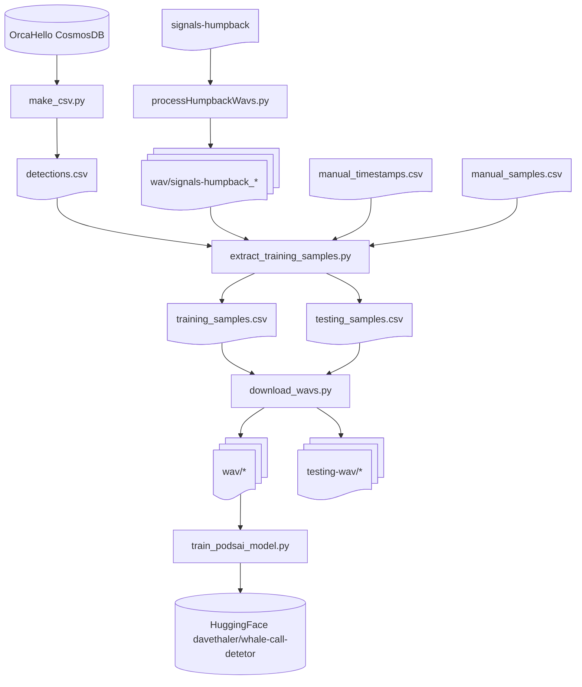

# Programmatic Orca Detection System using Artificial Intelligence (PODS-AI)

This repository contains scripts for preparing training data for orca detection models.

## Overview

The `src` directory has the following scripts for different steps meant to be run in the order listed:

1. **make_csv.py**: Create a CSV file (`output/csv/detections.csv`) with a set of detections.
   The CSV file has the following columns: Category, NodeName, Timestamp, URI, Description, and Notes.
2. **process_humpback_wavs.py**: Process files from the humpback submodule into the humpback subdirectory under `output/wav`.
   A custom segment duration can be specified with `--duration _seconds_` (default: 3 seconds).
3. **extract_training_samples.py**: Use an input CSV file (`output/csv/detections.csv` by default)
   to create `output/csv/training_samples.csv` and `output/csv/testing_samples.csv`. An alternate input filename can be specified with
   `--input _filename_`. A custom segment duration can be specified with `--duration _seconds_` (default: 3 seconds).
   - For `tp_human_only` detections, runs model inference on preceding 60 seconds to find correct timestamp
   - For other detections, subtracts the segment duration from the timestamp
   - `testing_samples.csv` uses detections-format rows, excludes training rows, and includes eligible samples per category:
     - Up to 10 standard eligible samples per category (excludes samples with confidence 0.0)
     - Additionally up to 10 `tp_machine_only` samples in the `resident` category
     - Additionally up to 10 `tp_human_only` samples per negative category (water, human, vessel, jingle)
4. **download_wavs.py**: Use `output/csv/training_samples.csv` and `output/csv/testing_samples.csv` to download wav files
   - Training samples are written to subdirectories under `output/wav`
   - Testing samples are written to subdirectories under `output/testing-wav`
   - For testing samples, all rows download 60-second wav files (`tp_human_only` uses the row timestamp; others are centered on the row timestamp)
5. **make_spectrograms.py**: Create a png file for each wav file in a subdirectory of `output/png`
6. **train_podsai_model.py**: A script to train a PODS-AI model on the generated training samples.



## Model-Based Timestamp Correction for tp_human_only

The `extract_training_samples.py` script now implements intelligent timestamp correction for `tp_human_only` detections:

### How it Works

For detections marked as `tp_human_only`:
1. Downloads 60 seconds of audio preceding the detection timestamp
2. Runs model inference to score each segment
3. Finds the highest scoring segment
4. Adjusts the timestamp based on the offset of the highest scoring segment

This matches the behavior described in the issue and follows the approach used in [aifororcas-livesystem's LiveInferenceOrchestratorV1.py](https://github.com/orcasound/aifororcas-livesystem/blob/main/InferenceSystem/src/LiveInferenceOrchestratorV1.py).

### Using the FastAI Model

By default, `extract_training_samples.py` uses the FastAI model with automatic download enabled.

#### Option 1: Default behavior (recommended)

Install dependencies and run the script:

```bash
pip install -r requirements.txt

# For Python 3.11+, apply compatibility patch
bash patch_fastai_audio.sh

cd src
python extract_training_samples.py
```

This will automatically download the default model from:
https://trainedproductionmodels.blob.core.windows.net/dnnmodel/11-15-20.FastAI.R1-12.zip

The model will be cached in `./model` directory for future runs.

**Note**: Python 3.11+ requires a patch to fastai_audio for compatibility. The `patch_fastai_audio.sh` script applies this fix automatically.

#### Option 2: Customize model version

To use a different model version, set the `MODEL_URL` environment variable:

```bash
pip install -r requirements.txt
bash patch_fastai_audio.sh  # For Python 3.11+
export MODEL_URL=https://trainedproductionmodels.blob.core.windows.net/dnnmodel/YOUR-MODEL-VERSION.zip
cd src
python extract_training_samples.py
```

#### Option 3: Use pre-downloaded model

If you've already downloaded the model manually:

```bash
pip install -r requirements.txt
bash patch_fastai_audio.sh  # For Python 3.11+

# Download and extract model
mkdir -p model
curl -o model.zip https://trainedproductionmodels.blob.core.windows.net/dnnmodel/11-15-20.FastAI.R1-12.zip
unzip model.zip -d .

# Run with pre-downloaded model (no auto-download needed)
cd src
export MODEL_AUTO_DOWNLOAD=false
export MODEL_PATH=../model
python extract_training_samples.py
```

#### Option 4: Use dummy model (for testing)

python extract_training_samples.py
```

#### Option 4: Use dummy model (for testing)

For testing without FastAI dependencies or model download:

```bash
cd src
export MODEL_TYPE=dummy
python extract_training_samples.py
```

The dummy model will generate mock predictions suitable for testing the timestamp correction logic.

### Model Configuration

The model behavior can be configured using environment variables:

- `MODEL_TYPE`: Type of model to use (`dummy` or `fastai`, default: `fastai`)
- `MODEL_PATH`: Path to the model directory (default: `./model`)
- `MODEL_AUTO_DOWNLOAD`: Whether to auto-download the model if not found (default: `true` for fastai, `false` for dummy)
- `MODEL_URL`: Custom URL for model zip file (optional, default: `https://trainedproductionmodels.blob.core.windows.net/dnnmodel/11-15-20.FastAI.R1-12.zip`)

## Requirements

Install dependencies:

```bash
pip install -r requirements.txt
```

Key dependencies:
- `boto3`: For accessing S3 audio files
- `ffmpeg-python`: For audio processing
- `librosa>=0.10.0`: For audio analysis
- `m3u8`: For HLS stream parsing
- `pytz`: For timezone handling
- `fastai==1.0.61`: For FastAI model support
- `torch>=2.1.0`: PyTorch deep learning framework
- `torchvision>=0.16.0`: Computer vision models and utilities
- `torchaudio>=2.1.0`: Audio processing for PyTorch
- `soundfile`: Audio file I/O
- `fastai_audio`: FastAI audio extensions (from GitHub)
- `pandas`, `pydub`: Data processing and audio manipulation

## Helper Scripts

- **spectrogram_visualizer.py**: Adapted from [aifororcas-livesystem](https://github.com/orcasound/aifororcas-livesystem/blob/main/InferenceSystem/src/spectrogram_visualizer.py)
- **model_inference.py**: Provides model inference interface for scoring audio samples
- **orcasite_feeds.py**: Lightweight module providing the `OrcasiteFeed` dataclass and
  `get_orcasite_feeds()` helper. Depends only on `requests` — no `azure-cosmos` — so
  scripts that only need the feeds REST API (e.g. `add_samples.py`) can import it
  without pulling in the full `make_csv` dependency tree.
- **add_samples.py**: Splits a WAV file into 3-second segments (2-second hop), saves each
  segment to a `new/` directory using the standard filename convention, and prints the
  predicted class for each segment. Useful for labelling new recordings and adding them
  to the training set. See [add_samples.py](#add_samplespy) below.
- **process_false_positives.py**: Re-checks rejected OrcaHello resident detections by
  downloading the 60-second WAV, re-running PODS-AI, and appending resident
  sub-segments with corrected classes to `output/csv/manual_samples.csv`.
  Supports `--category CATEGORY` to process only detections whose inferred
  actual category matches the provided value.
- **process_false_negatives.py**: Re-checks confirmed OrcaHello detections by
  downloading the 60-second WAV, re-running PODS-AI and OrcaHello segment inference,
  and appending segments where OrcaHello predicts resident but PODS-AI does not to
  `output/csv/manual_samples.csv` with corrected class `resident`.
- **run_inference.py**: Runs a model on a wav file and prints the global prediction,
  confidence, and per-class probabilities.
- **LiveInferenceOrchestrator.py**: Runs live/date-range HLS inference with the multiclass
  PODS-AI model and can upload positive detections (resident/transient/humpback)
  to Azure Blob Storage and Cosmos DB.
- **compare_models.py**: Evaluates and compares fastai, orcahello, and podsai models
  on the test set loaded from `output/csv/testing_samples.csv` (generated by `extract_training_samples.py`
  and downloaded by `download_wavs.py`).
  Reports correct identifications, false positives, false negatives, and average prediction time for each model.
- **get_best_timestamp.py**: Given a node slug and a detection timestamp, runs
  `process_sample()` and prints the corrected URI with the best timestamp.

### add_samples.py

Split a WAV recording into 3-second segments (with a 2-second hop — the same settings
used by `run_inference.py`), save each segment to a `new/` directory using the standard
filename convention, and print the predicted class for each segment.  The timestamp
encoded in each filename reflects the **actual start time** of that sample inside the
original recording.

Output files follow the same naming convention as `output/wav/humpback/` etc.:

```
{node_name_with_hyphens}_{YYYY_MM_DD_HH_MM_SS_PST}.wav
```

Inference always uses the **PODS-AI (podsai)** model type.  The default model is
`davethaler/whale-call-detector` on HuggingFace Hub; override with `--model-path`.

If `--node-name` and `--timestamp` are omitted, the script infers them from the input
filename.  The filename must follow the same convention:
`{node_name_with_hyphens}_{YYYY_MM_DD_HH_MM_SS_PST}.wav`
(e.g. `rpi-orcasound-lab_2025_12_17_22_34_03_PST.wav` → node `rpi_orcasound_lab`,
timestamp `2025_12_17_22_34_03_PST`).

After reviewing the predictions you can move the segments into the appropriate
`output/wav/<category>/` directory to add them to the training set.

```
usage: python add_samples.py <wav_file> [--node-name NAME] [--timestamp TIMESTAMP]
                             [--output-dir DIR] [--model-path PATH] [--uri URI]
```

| Argument | Description |
|---|---|
| `wav_file` | Path to the input WAV file to segment |
| `--node-name` | Hydrophone node name (e.g. `rpi_orcasound_lab`). Underscores are replaced with hyphens in output filenames. **Inferred from the input filename if omitted.** |
| `--timestamp` | PST timestamp of the **start** of the recording (e.g. `2025_01_15_12_30_00_PST`). **Inferred from the input filename if omitted.** |
| `--output-dir` | Directory to save segments (default: `new`) |
| `--model-path` | HuggingFace Hub model ID or path to a local podsai model directory (default: `davethaler/whale-call-detector`) |
| `--uri` | Optional custom URI to use for all segments. If provided, all output rows will use this URI instead of generating one per segment. Useful when all segments come from the same detection. |

**Example — node name and timestamp inferred from filename**

```bash
cd src
python add_samples.py rpi-orcasound-lab_2025_01_15_12_30_00_PST.wav
```

**Example — explicit node name and timestamp with custom model**

```bash
cd src
python add_samples.py /path/to/recording.wav \
    --node-name rpi_orcasound_lab \
    --timestamp 2025_01_15_12_30_00_PST \
    --model-path /path/to/local-model
```


**Example — use custom URI for all segments**

When all segments come from the same detection event, you can specify a single URI
to use for all output rows:

```bash
cd src
python add_samples.py /path/to/recording.wav \
    --node-name rpi_orcasound_lab \
    --timestamp 2025_01_15_12_30_00_PST \
    --uri "https://live.orcasound.net/bouts/new/rpi_orcasound_lab?time=2025-01-15T20%3A30%3A00.000Z"
```

Output:
```
Saved: new/rpi-orcasound-lab_2025_01_15_12_30_00_PST.wav
Saved: new/rpi-orcasound-lab_2025_01_15_12_30_02_PST.wav
Saved: new/rpi-orcasound-lab_2025_01_15_12_30_04_PST.wav
...

Loading podsai model from /path/to/local-model...

Segment predictions:
  rpi-orcasound-lab_2025_01_15_12_30_00_PST.wav: water
  rpi-orcasound-lab_2025_01_15_12_30_02_PST.wav: resident
  rpi-orcasound-lab_2025_01_15_12_30_04_PST.wav: resident
  ...
```

### run_inference.py

Run model inference on a wav file and display the global prediction, confidence score,
and per-class probabilities.  For PODS-AI models the per-class probability is the
mean of all `local_confidence` values (from windows predicting that class) that exceed
the model's threshold — the same statistic used for `global_confidence`.  For the FastAI
binary model, `resident = global_confidence` and `other = 1 - global_confidence`.

```
usage: python run_inference.py <wav_file> [--model {podsai,fastai,orcahello}] [--model-path PATH]
```

| Argument | Description |
|---|---|
| `wav_file` | Path to the wav file to score |
| `--model` | Model type: `podsai` (default), `fastai`, or `orcahello` |
| `--model-path` | Path to model directory or HuggingFace Hub model ID. Required for `podsai`; defaults to `./model` for `fastai`; defaults to `orcasound/orcahello-srkw-detector-v1` for `orcahello`; defaults to `davethaler/whale-call-detector` for `podsai` |

**Example — PODS-AI model**

```bash
cd src
python run_inference.py sample.wav --model podsai
```

Output:
```
Model type: podsai
Global prediction: resident (confidence: 0.7000)
Prediction time: 1.23s

Per-class probabilities:
  humpback: 0.0000
  human: 0.0000
  jingle: 0.0000
  resident: 0.7000
  transient: 0.0000
  vessel: 0.0000
  water: 0.0000
```

**Example — FastAI model**

```bash
cd src
python run_inference.py sample.wav --model fastai --model-path ../model
```

Output:
```
Model type: fastai
Global prediction: resident (confidence: 0.7500)
Prediction time: 0.85s

Per-class probabilities:
  other: 0.2500
  resident: 0.7500
```

**Example — OrcaHello SRKW Detector**

Uses the [`orcasound/orcahello-srkw-detector-v1`](https://huggingface.co/orcasound/orcahello-srkw-detector-v1)
model from HuggingFace Hub. This is a binary SRKW (Southern Resident Killer Whale) detector
based on the new OrcaHello inference pipeline (ResNet50 + mel spectrograms, no fastai_audio dependency).

The model implementation is loaded from the `orcasound/orcahello` submodule. Initialize it first:

```bash
git submodule update --init external/orcahello
```

Then run inference:

```bash
cd src
python run_inference.py sample.wav --model orcahello
```

Output:
```
Model type: orcahello
Global prediction: resident (confidence: 0.8000)
Prediction time: 0.92s

Per-class probabilities:
  other: 0.2000
  resident: 0.8000
```

You can compare results between models by running each on the
same file and comparing the output.

### compare_models.py

Evaluate and compare fastai, orcahello, and podsai models on the same test set of
60-second audio samples.  Loads the test set directly from `output/csv/testing_samples.csv`
(generated by `extract_training_samples.py`), then runs each enabled model on the
corresponding WAV files under `output/testing-wav/`
(downloaded by `download_wavs.py`), and reports a summary table
with correct identifications, false positives, false negatives, and average prediction time.

Evaluation uses a binary resident-vs-other framing that works across all three models:
- **Correct** – model predicted "resident" (SRKW) when the label is "resident", or
  anything other than "resident" when the label is not "resident".
- **False positive** – model predicted "resident" when the correct label is not "resident".
- **False negative** – model predicted something other than "resident" when the label is "resident".

```
usage: python compare_models.py [--testing-csv PATH] [--max-samples N]
                                [--wav-dir PATH] [--models MODEL_LIST]
                                [--fastai-model-path PATH]
                                [--orcahello-model-path PATH]
                                [--podsai-model-path PATH]
                                [--category CATEGORY]
```

| Argument | Description |
|---|---|
| `--testing-csv` | Path to `testing_samples.csv` (default: `output/csv/testing_samples.csv`) |
| `--max-samples` | Maximum number of test samples to process. If not specified, all samples are processed |
| `--wav-dir` | Root directory of testing WAV files (default: `output/testing-wav`) |
| `--models` | Comma-separated list of models to evaluate (default: `fastai,orcahello,podsai`) |
| `--fastai-model-path` | Path to FastAI model directory. Defaults to `model` when not specified |
| `--orcahello-model-path` | HuggingFace Hub ID or path for OrcaHello model. Defaults to `orcasound/orcahello-srkw-detector-v1` when not specified |
| `--podsai-model-path` | Path or Hub ID for PODS-AI model. Defaults to `davethaler/whale-call-detector` when not specified |
| `--category` | Only evaluate samples from this category (e.g. `resident`, `humpback`, `water`). If not specified, all categories are evaluated |

**Example — compare all three models**

```bash
python src/compare_models.py \
    --models fastai,orcahello,podsai \
    --fastai-model-path model \
    --podsai-model-path /path/to/podsai-model
```

Output:
```
Loaded 160 test samples from output\csv\testing_samples.csv
WAV directory: output/testing-wav
Models to evaluate: fastai, orcahello, podsai

  ...

==========================================================================================
Model Comparison Summary
==========================================================================================
Model           Evaluated   Correct  Accuracy     FP     FP%     FN     FN%   Avg Time
------------------------------------------------------------------------------------------
fastai                160        68     42.5%     61   38.1%     31   19.4%     12.00s
orcahello             160        42     26.2%     95   59.4%     23   14.4%      5.06s
podsai                160       104     65.0%     16   10.0%     40   25.0%      4.64s
==========================================================================================

Definitions:
  Correct      = predicted resident when expected, or non-resident when expected
  FP (false+)  = predicted resident when correct class was non-resident
  FN (false-)  = predicted non-resident when correct class was resident
  Avg Time     = average time spent in model predict() per 60-second WAV file

Confusion Matrix for fastai (rows=actual, cols=predicted):
                 other   resident
      human          6          4
   humpback         17         13
     jingle          8          2
   resident         31         29
  transient          4         26
     vessel          4          6
      water          0         10

Confusion Matrix for orcahello (rows=actual, cols=predicted):
                 other   resident
      human          0         10
   humpback          5         25
     jingle          0         10
   resident         23         37
  transient          0         30
     vessel          0         10
      water          0         10

Confusion Matrix for podsai (rows=actual, cols=predicted):
                 human   humpback     jingle   resident  transient     vessel      water
      human          9          0          0          0          1          0          0
   humpback          1          8         11          6          4          0          0
     jingle          0          0         10          0          0          0          0
   resident          2          5          3         20         13          2         15
  transient          0          4          2          9         14          0          1
     vessel          0          0          0          1          0          9          0
      water          0          0          0          0          0          0         10
```

**Example - compare only fastai and orcahello**

```bash
python src/compare_models.py --models fastai,orcahello --fastai-model-path model
```

**Example - limit to 10 test samples**

```bash
python src/compare_models.py --max-samples 10 --fastai-model-path model
```

**Example - evaluate only resident samples**

```bash
python src/compare_models.py --category resident --fastai-model-path model
```

### get_best_timestamp.py

```
usage: python get_best_timestamp.py <node_slug> <timestamp_str> [--no-model] [--duration N]
```

| Argument | Description |
|---|---|
| `node_slug` | Node URL slug, e.g. `orcasound-lab` |
| `timestamp_str` | PST timestamp, e.g. `2023_08_18_00_59_53_PST` |
| `--no-model` | Skip model inference; apply a fixed-offset correction instead |
| `--duration N` | Segment duration in seconds (default: 3) |

The script uses the same model-based timestamp correction logic as
`extract_training_samples.py` (see [Model-Based Timestamp Correction](#model-based-timestamp-correction-for-tp_human_only)
above).  The same `MODEL_TYPE`, `MODEL_PATH`, `MODEL_AUTO_DOWNLOAD`, and
`MODEL_URL` environment variables apply.

**Example**

```bash
cd src
python get_best_timestamp.py orcasound-lab 2023_08_18_00_59_53_PST
# https://live.orcasound.net/bouts/new/orcasound-lab?time=2023-08-18T07%3A59%3A50.000Z
```

## Architecture

The timestamp correction implementation follows the architecture described in the [aifororcas-livesystem](https://github.com/orcasound/aifororcas-livesystem):

- Uses `DateRangeHLSStream` approach to download audio from specific time ranges
- Downloads from Orcasound S3 buckets: `s3-us-west-2.amazonaws.com/audio-orcasound-net/`
- Processes HLS streams with m3u8 playlists
- Uses FFmpeg for audio format conversion
- Returns `local_confidences` array with scores for each segment

## Example Configuration

Similar to [aifororcas-livesystem config files](https://github.com/orcasound/aifororcas-livesystem/blob/main/InferenceSystem/config/Test/Positive/FastAI_DateRangeHLS_AndrewsBay.yml):

```yaml
model_type: "FastAI"
model_local_threshold: 0.5
model_global_threshold: 3
model_path: "./model"
model_name: "model.pkl"
```
