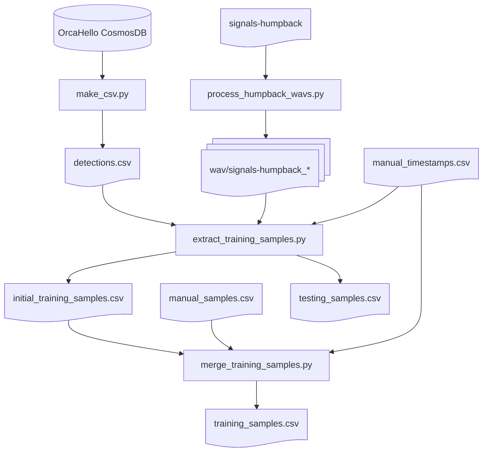

# Bootstrap Data Generation (Archived)

The files in `bootstrap/` preserve the initial dataset-generation pipeline and source CSV inputs.
They are archived so ongoing development can focus on `output/csv/training_3s_samples.csv`
and `output/csv/testing_60s_samples.csv`.

## Bootstrap scripts

Scripts are in `bootstrap/src/` and are meant for one-time or occasional regeneration:

1. `make_csv.py` → writes `bootstrap/csv/detections.csv`
2. `process_humpback_wavs.py` → generates `output/wav/humpback/signals-humpback_*.wav`
3. `extract_training_samples.py` → writes `bootstrap/csv/initial_training_samples.csv` and `bootstrap/csv/testing_samples.csv`
4. `merge_training_samples.py` → merges bootstrap training inputs into `bootstrap/csv/training_samples.csv`
5. `get_best_timestamp.py` → computes a corrected URI timestamp using bootstrap timestamp-correction logic

## Archived CSV files

`bootstrap/csv/` contains:

- `detections.csv`
- `manual_timestamps.csv`
- `manual_samples.csv`
- `initial_training_samples.csv`
- preserved snapshots of `training_samples.csv` and `testing_samples.csv`

## Bootstrap flow



## get_best_timestamp.py

```bash
python bootstrap/src/get_best_timestamp.py <node_slug> <timestamp_str> [--no-model] [--duration N]
```

Examples:

```bash
python bootstrap/src/get_best_timestamp.py orcasound-lab 2023_08_18_00_59_53_PST
# https://live.orcasound.net/bouts/new/orcasound-lab?time=2023-08-18T07%3A59%3A50.000Z
```
